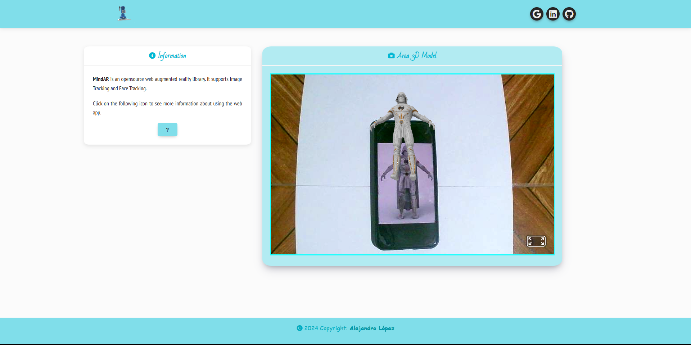
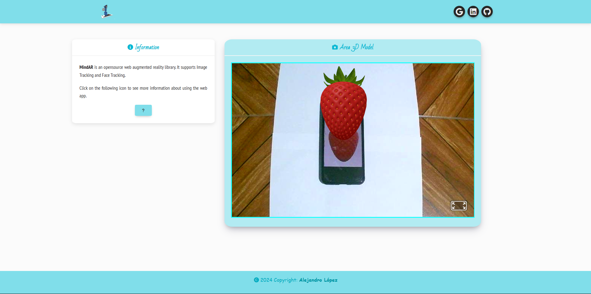
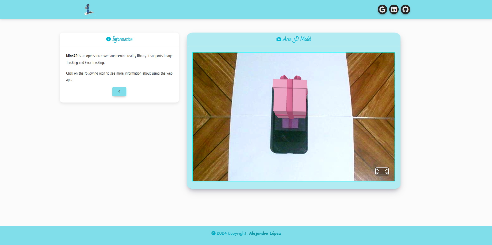
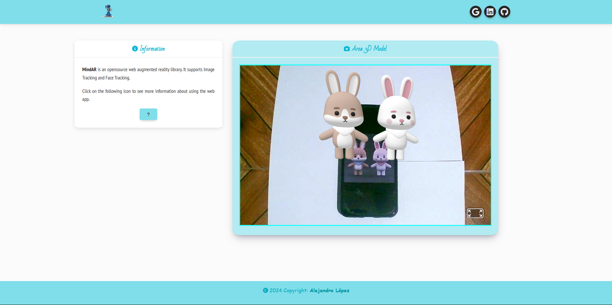

# <h1 align="center" style="color: #80cbc4;"> AR 3D Object 👨🏻‍💻 </h1> 
  

The following web app shows some 3D models using the MindAR library.
 

` MindAR ` is a JavaScript library for implementing marker-based augmented reality (AR). Use images as markers to overlay 3D models, animations, or HTML elements on the user's camera.
  

  

## 
 Requirements 

- [HTML5](https://developer.mozilla.org/es/docs/Web/HTML) 
- [CSS3](https://developer.mozilla.org/es/docs/Web/CSS)
- [BootStrap](https://mdbootstrap.com/)
- [MindAR](https://hiukim.github.io/mind-ar-js-doc/)
- [MindAR Image Targets Compiler](https://hiukim.github.io/mind-ar-js-doc/tools/compile/)

  

## 
 Screenshot Project 💻 

🔶 [Project Website](https://alejandro-190107.github.io/AR-3D-Object/)

